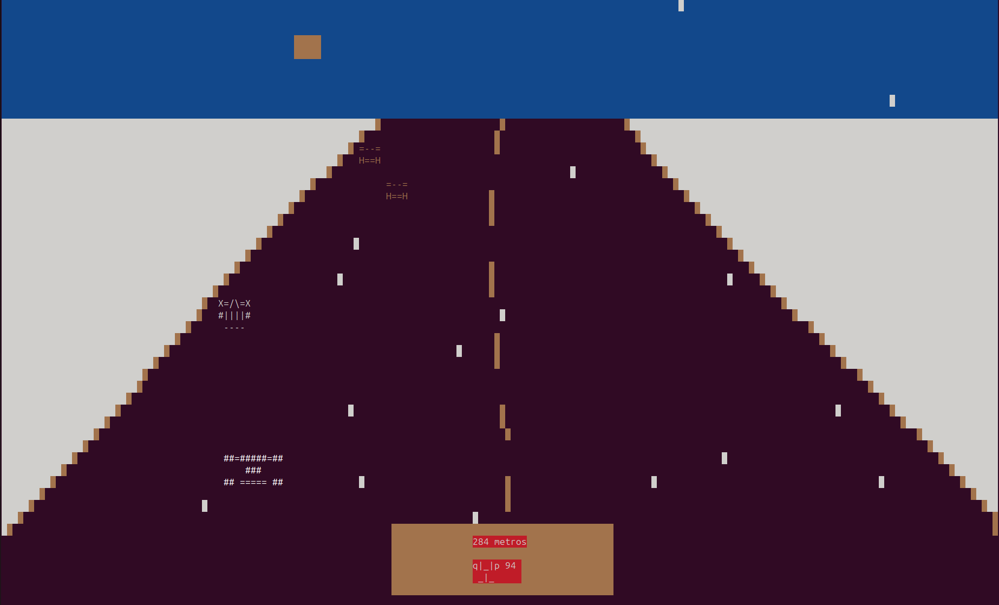

# Enduro em C

---

## Descrição

**Enduro** é um jogo de corrida retrô desenvolvido em **C** utilizando a biblioteca **ncurses** para graficos no terminal.  
Inspirado no clássico **Enduro** do Atari 2600, o jogo vai colocar você ao volante em uma corrida sem fim, onde o objetivo é **desviar de outros carros** e **acumular a maior pontuação possível** enquanto os diversas situações climáticas e temporais podem atrapalhar.
---

## Demonstração

<p align="center">
  
  
  
  
</p>

---

## Tecnologias Utilizadas

- [C Language – ISO Standard](https://www.open-std.org/jtc1/sc22/wg14/) — linguagem principal do projeto.
- [ncurses – Official Website](https://invisible-island.net/ncurses/) — framework para construção de interface gráfica (GUI).
- 'Linux' — É o sistema operacional alvo do jogo.

---

### Baixar executavel

[Baixar executavel](https://github.com/Jovito5s9/jogo_enduro/releases/download/v1.0/enduro)

### Passos para clonar o repositório

```bash
git clone https://github.com/Jovito5s9/jogo_enduro.git
cd jogo_enduro

gcc enduro.c -o enduro -lncurses -lm
./enduro